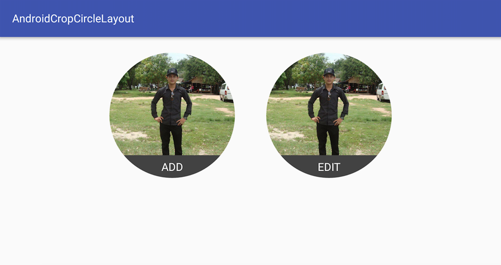

# AndroidCropCircleLayout

## Getting Started

This library will allow developer to crop their relative layout in circle with style like gmail profile image.

## Demo


## Installing

We can install this library by using gradle

Step 1

```
allprojects {
	repositories {
			maven { url 'https://jitpack.io' }
		}
	}
```

Step 2

```
dependencies {
	        compile 'com.github.BondolTuon:AndroidCropCircleLayout:1.0.0'
	}
```

## Sample Using

```
<com.tuonbondol.cropcirclelayout.RoundedCornerLayout
        android:layout_width="160dp"
        android:layout_height="160dp"
        android:layout_margin="20dp">

        <ImageView
            android:layout_width="match_parent"
            android:layout_height="match_parent"
            android:src="@drawable/user_profile" />

        <TextView
            android:layout_width="match_parent"
            android:layout_height="wrap_content"
            android:layout_alignParentBottom="true"
            android:background="#424242"
            android:gravity="center"
            android:padding="5dp"
            android:text="ADD"
            android:textColor="@android:color/white"
            android:textSize="14sp" />
    </com.tuonbondol.cropcirclelayout.RoundedCornerLayout>

```

## Min SDK Version

```
Support Min Sdk version >= 14

```

## Authors

* **Bondol Tuon** - [Bondol Tuon](https://github.com/BondolTuon)

See also the list of [contributors](https://github.com/BondolTuon/AndroidCropCircleLayout/contributors) who participated in this project.

## License

This project is licensed under the MIT License - see the [LICENSE.md](https://github.com/BondolTuon/TextViewUtilAndroid/blob/1.x/README.md) file for details
